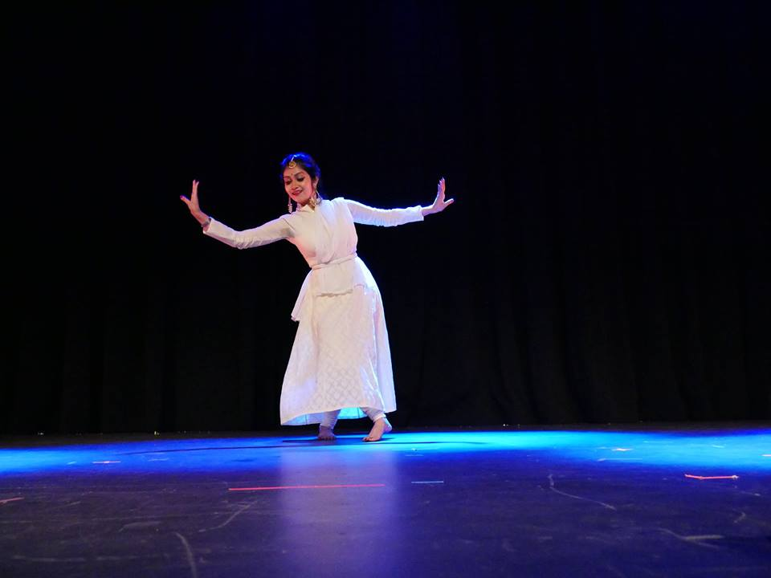

<figure>
  
</figure>

I have extensive training in Indian classical dance, painting and singing. I greatly enjoy hosting events and have mc-ed a lot of events and seminars. Below are the links to some of my performances.

### &#x25A3; December, 2017. Official Music Video of Tum Bin: The Musical Experience

We danced in the official music video of the song "Bahon Mein Aa Zara" by Madhumita Chatterjee & Kumar Sanu. This song is from music album Tum Bin: The Musical Experience. Parts of the song was shot in the Sepulveda dam. 

<a href="https://www.youtube.com/watch?v=bDBjPZix4eE"><b>Click here for youtube Link of the Video</b></a>

### &#x25A3; Oct, 2017. Performed at USC Bovard Auditorium for Diwali

Diwali is one of the most celebrated and festive events on USC campus. AIS USC hosts an annual cultural program in the Bovard Auditorium which is attended by USC students, faculty, alumni as well as members from the Indian diaspora. 

<a href="https://youtu.be/Y2kzaL4mLCw"><b>Click here for youtube Link of the Video</b></a>

### &#x25A3; Nov, 2017. Performed at USC TCC Ballroom.

Below is the link to my solo dance performance at the TCC Ballroom, USC.  

<a href="https://youtu.be/Bahj06-m96k"><b>Click here for youtube Link of the Video</b></a>

### &#x25A3; Feb, 2017. Indian Classical Vocal, Torrence, CA

I performed a few Indian classical music vocals for Saraswati puja at Dakshini Bengali Association of California. It included songs by Rabindranath Tagore.

### &#x25A3; July, 2017. North American Bengali Conference (NABC), San Jose, CA

The North American Bengali Conference (NABC) is an annual Bengali culture conference held in the United States and Canada. Our Southern California group was a part of the openning ceremony. Here are the videos of our performances. 

